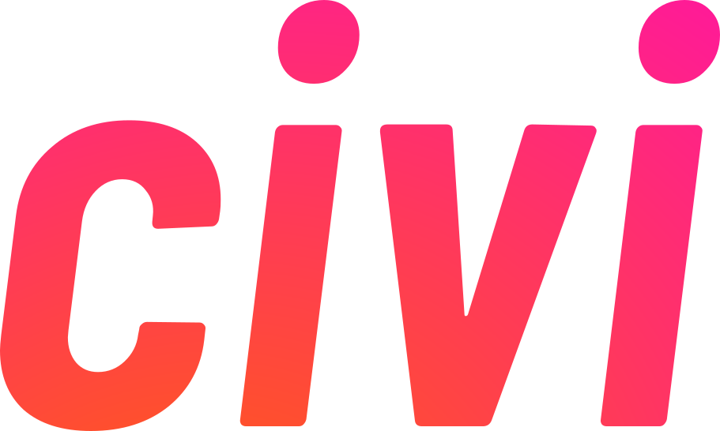

[civi.social](https://civi.social)

### About the group

We want to create a social network for elected officials to get feedback from their residents on real bills & resolutions.

A few goals:

- Focus on official things: verified elected officials engaging with registered voters on actual bills & resolutions.
- Start local (alderpeople, city/county officials).
- Growth strategy: prefer fewer elected officials with higher engagement than lots of elected officials with low engagement.
- Maintaining 3rd party status / non-profit-esque/open-source-y status.

## Things to Build

- Verification: Process to verify users are residents and constituents of elected officials.
- Database: Source of truth that instills trust in the data.
- UX: Advanced notification system that creates high visibility for bills/resolutions residents would care about.
- UX: Polling system and communication UX for different bills.
- UX: Sharing system that creates a natural marketing tool on other sites/social networks.
- Pilot Marketing: Getting pilot alderperson and highly engaged residents.
- Revenue: Source of money that can sustain R&D & Growth.

### Group leaders

Brian Burns - @bbgits (Domain & Software)
Sartaj - @sartaj (Design & Software)

### Who we're looking for

Humanists and philosophers who are interested in the intersection of tech & civic engagement would be very useful.

Skills that would be useful include decentralized database experts, ID verification, JavaScript enthusiasts, social network UX design, and civic engagement experts.

### Discussions

We meet in the Chi Hack Night [#civic-engagement-platform
](https://chihacknight.slack.com/archives/C047500M5RS) Slack Channel. During hack nights, we may also meet on [this Google Meet](https://meet.google.com/hjn-uxvy-woq).

### Development

[See `docs/development.md`](./docs/development.md)
